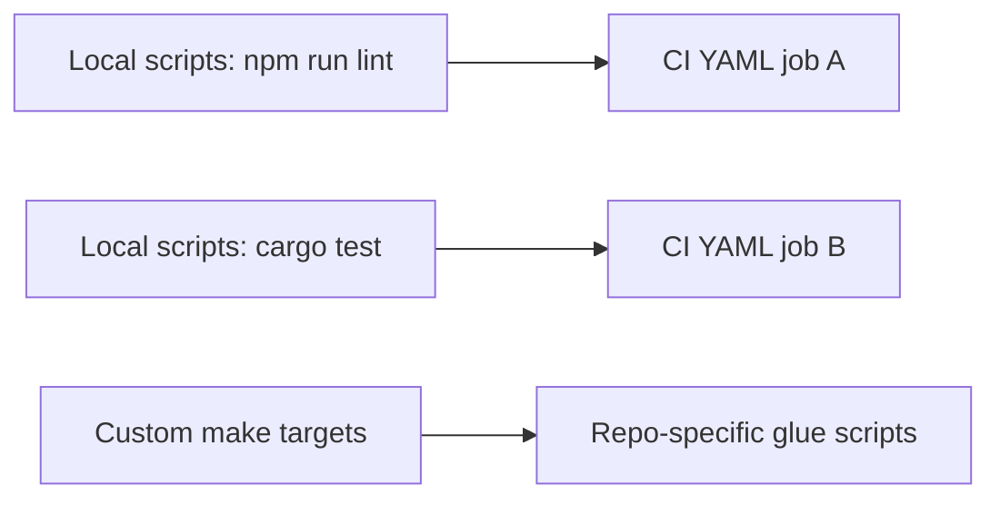
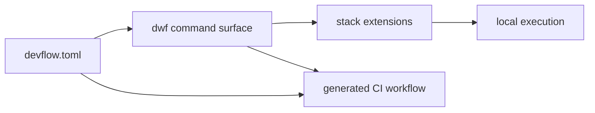

# Problem and Workflow Model

## Typical Workflow Today (Without Devflow)

Common issues:

- duplicate logic across scripts, Makefiles, and CI YAML
- inconsistent command names across repositories
- local success but CI failure due to workflow drift

## Workflow With Devflow

Benefits:

- same commands locally and in CI
- DRY policy definition in `targets.*`
- reproducible workflow generation and validation (`ci:generate`, `ci:check`)
