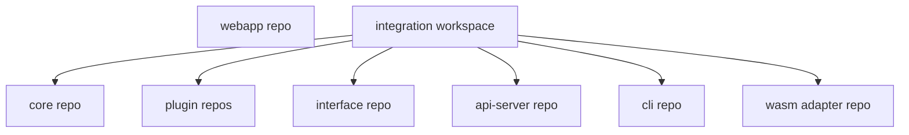
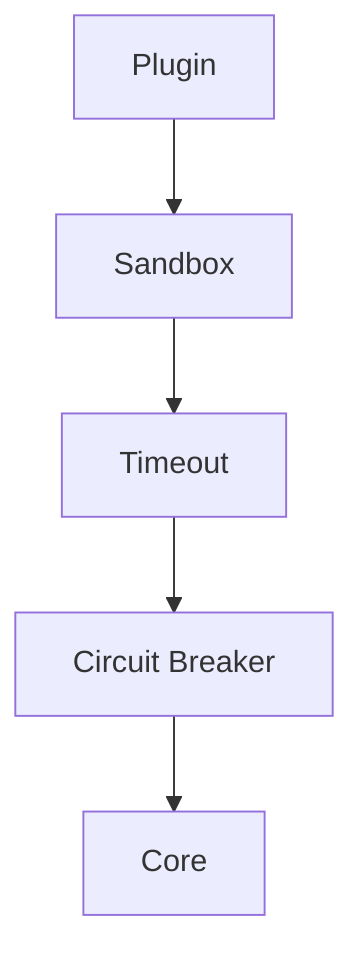

# 1. Objective

This document translates the architecture into a **production-ready implementation template** covering:

- Multi-repo structure
- Layered crate constructs
- Interface & transport abstraction
- Plugin runtime traits (sandboxing, timeout, circuit breaker)
- Cross-cutting traits (auth, tls, tracing, resilience)
- Contract & DTO design
- Dev + CI blueprint

The intent is to provide a **repeatable template** for building extensible Rust systems.

---

# 2. Repository Blueprint (Multi-Repo + Integration Workspace)



---

# 3. Core Crate Template

## Directory structure

```text
core/
 ├─ Cargo.toml
 ├─ src/
 │   ├─ domain/
 │   ├─ services/
 │   ├─ ports/
 │   ├─ plugin_api/
 │   ├─ errors.rs
 │   └─ lib.rs
```

---

## Core design rules
- No transport dependencies
- No serialization logic
- Pure domain + workflows
- Async traits for ports

---

## Example port trait

```rust
#[async_trait::async_trait]
pub trait Storage: Send + Sync {
    async fn save(&self, item: Project) -> Result<()>;
}
```

---

# 4. Interface Crate Template

## Responsibilities
- DTOs
- Mapping
- Contract schemas
- Versioning

---

## Structure

```text
interface/
 ├─ dto/
 ├─ mapping/
 ├─ schema/
 └─ lib.rs
```

---

## DTO example

```rust
#[derive(Serialize, Deserialize)]
pub struct ProjectDto {
    pub id: String,
    pub name: String,
}
```

---

## Mapping example

```rust
impl From<Project> for ProjectDto {
    fn from(p: Project) -> Self {
        Self { id: p.id.to_string(), name: p.name }
    }
}
```

---

# 5. Transport Abstraction Crate

## Purpose
Encapsulate HTTP, RPC, Events, IPC behind a unified trait model.

---

## Transport traits

```rust
#[async_trait::async_trait]
pub trait RequestHandler {
    async fn handle(&self, req: Payload) -> Result<Payload>;
}

pub trait Transport {
    fn start(self) -> Result<()>;
}
```

---

# 6. Serialization Strategy Crate

```text
serde-strategy/
 ├─ json.rs
 ├─ msgpack.rs
 ├─ cbor.rs
 └─ lib.rs
```

---

## Serializer trait

```rust
pub trait Serializer {
    fn encode<T: Serialize>(&self, value: &T) -> Result<Vec<u8>>;
    fn decode<T: DeserializeOwned>(&self, data: &[u8]) -> Result<T>;
}
```

---

# 7. Plugin Runtime Template

## Plugin crate structure

```text
plugin-example/
 ├─ src/lib.rs
 └─ manifest.toml
```

---

## Plugin trait

```rust
#[async_trait::async_trait]
pub trait Plugin: Send + Sync {
    fn metadata(&self) -> PluginMetadata;
    async fn execute(&self, ctx: PluginContext) -> Result<PluginOutput>;
}
```

---

# 8. Sandbox Trait (Security Boundary)

```rust
#[async_trait::async_trait]
pub trait Sandbox {
    async fn run<F, T>(&self, f: F) -> Result<T>
    where
        F: Future<Output = Result<T>> + Send;
}
```

---

# 9. Timeout Wrapper Trait

```rust
#[async_trait::async_trait]
pub trait Timeout {
    async fn with_timeout<F, T>(&self, dur: Duration, f: F) -> Result<T>
    where
        F: Future<Output = Result<T>> + Send;
}
```

---

# 10. Circuit Breaker Trait

```rust
#[async_trait::async_trait]
pub trait CircuitBreaker {
    async fn call<F, T>(&self, key: &str, f: F) -> Result<T>
    where
        F: Future<Output = Result<T>> + Send;
}
```

---

# 11. Secure Plugin Execution Stack



---

# 12. Cross-Cutting Middleware Traits

## Auth trait

```rust
#[async_trait::async_trait]
pub trait Authenticator {
    async fn authenticate(&self, token: &str) -> Result<Identity>;
}
```

---

## TLS abstraction

```rust
pub trait TlsProvider {
    fn client_config(&self) -> TlsConfig;
    fn server_config(&self) -> TlsConfig;
}
```

---

## Observability trait

```rust
pub trait Telemetry {
    fn record_span(&self, name: &str);
    fn record_metric(&self, key: &str, value: f64);
}
```

---

# 13. API Server Template

```text
api-server/
 ├─ router/
 ├─ handlers/
 ├─ middleware/
 └─ main.rs
```

---

## Handler example

```rust
async fn create_project(
    Json(dto): Json<ProjectDto>,
    State(app): State<AppState>,
) -> Result<Json<ProjectDto>> {
    let domain = dto.try_into()?;
    let out = app.service.execute(domain).await?;
    Ok(Json(out.into()))
}
```

---

# 14. WASM Adapter Template

```text
wasm/
 ├─ bindings.rs
 └─ lib.rs
```

---

## WASM boundary example

```rust
#[wasm_bindgen]
pub async fn run(input: JsValue) -> Result<JsValue, JsValue> {
    let dto: ProjectDto = serde_wasm_bindgen::from_value(input)?;
    let out = service.execute(dto.try_into()?).await?;
    Ok(serde_wasm_bindgen::to_value(&ProjectDto::from(out))?)
}
```

---

# 15. Event Interface Template

```rust
pub trait EventBus {
    async fn publish(&self, evt: Event) -> Result<()>;
    async fn subscribe(&self, topic: &str) -> Result<Stream<Event>>;
}
```

---

# 16. Error Model

```rust
#[derive(thiserror::Error)]
pub enum AppError {
    #[error("validation error")]
    Validation,
    #[error("internal error")]
    Internal,
}
```

---

# 17. Dev Workflow Blueprint

## Dev mode
- JSON serialization
- In-memory plugins
- Local transport
- Debug tracing

## Prod mode
- Binary serialization internal
- WASM plugins
- CDN assets
- TLS enforced
- Circuit breaker enabled

---

# 18. CI/CD Blueprint

- Contract compatibility tests
- Plugin conformance tests
- Integration workspace build
- Schema diff validation
- WASM plugin test harness

---

# 19. Risk Mitigation Mapping

| Risk | Mitigation |
|------|------------|
| Version drift | contract pinning |
| Plugin ABI | WASM boundary |
| Debuggability | JSON debug mirror |
| Integration | meta workspace |
| Serialization overhead | binary internal |
| Security | sandbox + capability model |

---

# 20. Next Steps

Potential follow-ups:

- Reference implementation repo
- Plugin manifest spec
- WASM plugin runtime design
- Contract compatibility checker
- Devcontainer blueprint
- Adapter test harness
- Multi-repo release orchestration
