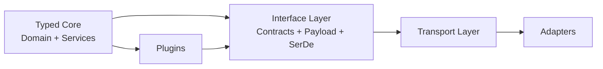
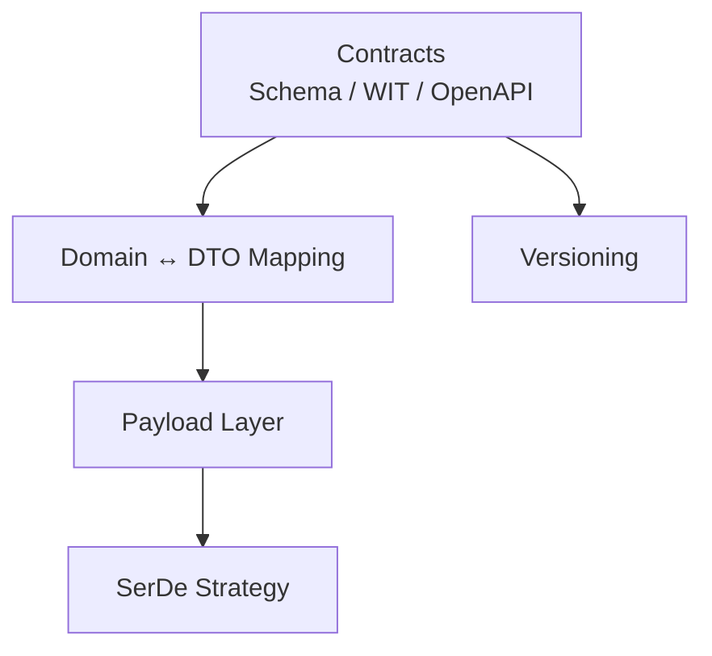
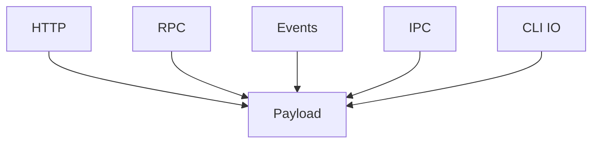
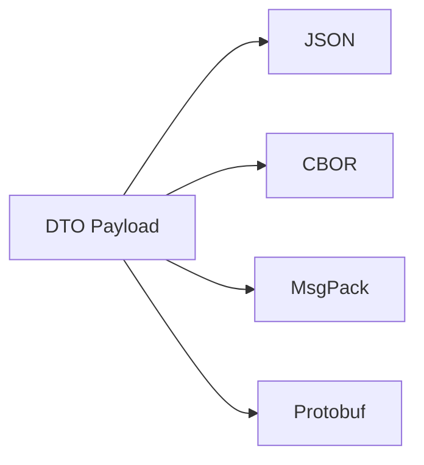
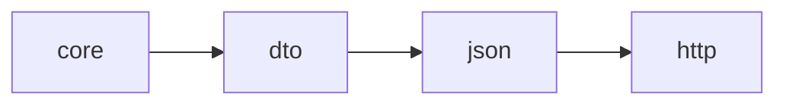
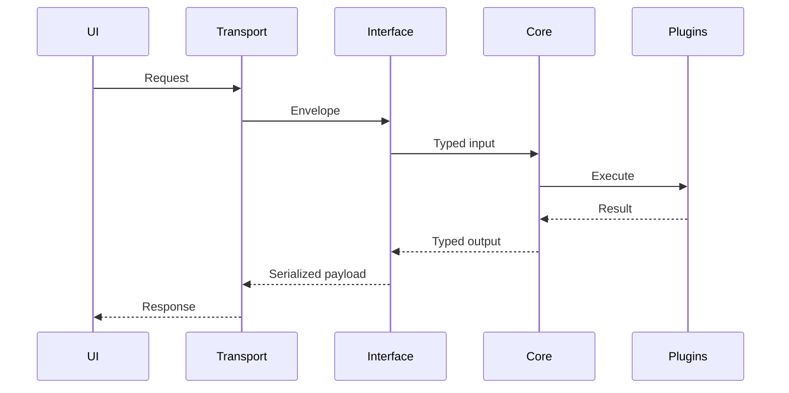
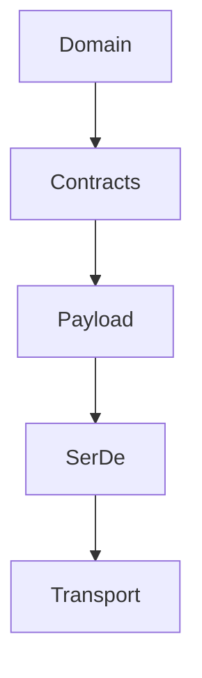
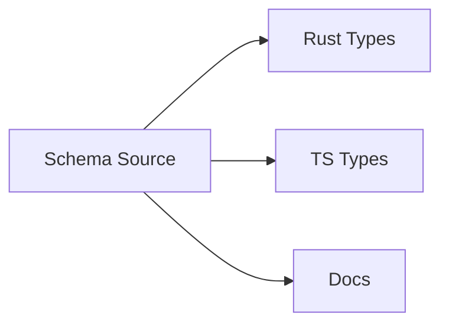

# 1. Context

This revision introduces a **first-class Interface & Communication Layer** that sits above the typed core and enables:

- Transport abstraction (HTTP, RPC, Events, IPC)
- Pluggable serialization formats
- Zero-config sensible defaults
- Evolution without breaking adapters
- Uniform debugging & observability

The goal is to preserve **strong typing internally while allowing flexible external interfaces**.

---

# 2. Updated High-Level Architecture



### Key insight
Core does not depend on transport or serialization.  
Interfaces mediate between typed domain and external world.

---

# 3. Interface Layer Responsibilities

## Responsibilities
- Define contracts
- Map domain ↔ payload
- Handle serialization formats
- Versioning
- Validation
- Error normalization

---

## Interface layer decomposition



---

# 4. Transport Layer

Transport becomes a thin envelope around payload.



This separation enables:

- Same payload across transports
- Adapter portability
- Better testability

---

# 5. Payload Strategy

## DTO layer (external representation)
- Immutable
- Backward compatible
- Explicit versioning
- No domain invariants

## Mapping layer
- Domain → DTO
- DTO → Domain (validation)

---

# 6. Serialization Strategy

## Requirements
- Human friendly (debugging)
- Efficient
- Evolvable
- Language neutral

---

## Multi-format SerDe model



---

## Recommended defaults

| Context | Format |
|-------|--------|
| Public API | JSON |
| Internal RPC | MessagePack |
| Events | JSON / CloudEvents |
| WASM | WIT |
| High throughput | CBOR |

---

# 7. Zero-Config Strategy

## Default path



No configuration required for most users.

Advanced users can override:
- serialization format
- transport
- version negotiation

---

# 8. Multi-Surface Interaction Flow



---

# 9. Risk Mitigation Strategies

## Risk 1 — Version drift across repos

### Mitigation
- Contract-first design
- Schema version pinning
- Compatibility test suite
- Interface conformance tests

---

## Risk 2 — Serialization overhead

### Mitigation
- Binary formats for internal paths
- Zero-copy deserialization where possible
- DTO flattening
- Avoid domain → DTO churn

---

## Risk 3 — Plugin ABI instability

### Mitigation
- WASM plugin boundary
- Stable plugin API crate
- Capability-based interfaces
- Version handshake

---

## Risk 4 — Integration complexity

### Mitigation
- Meta integration repo
- Contract mocks
- Adapter test harness
- Devcontainer for reproducibility

---

## Risk 5 — Debuggability loss with binary formats

### Mitigation
- Debug mode JSON mirror
- Structured tracing payload logs
- Schema-aware inspector tools

---

# 10. Evolution Strategy

## Layered evolution model



### Principle
Each layer evolves independently with compatibility guarantees.

---

# 11. Contract Strategy

## Contract sources
- OpenAPI (HTTP)
- JSON Schema (DTO)
- WIT (WASM)
- Protobuf (optional internal)

---

## Contract sharing



---

# 12. Error Handling Model

## Unified error envelope

```json
{
  "type": "https://example/errors/invalid-input",
  "title": "Invalid input",
  "detail": "...",
  "trace_id": "...",
  "instance": "...",
  "metadata": {}
}
```

Based on RFC7807.

---

# 13. Security Strategy

- Capability-based plugin permissions
- Signed plugin manifests
- Schema validation
- Input sanitization
- Event provenance
- Content Security Policy (webviews)
- Transport encryption

---

# 14. Trade-off Summary

| Decision | Benefit | Cost |
|--------|--------|------|
| Separate transport & payload | Flexibility | Complexity |
| Interface layer | Evolution safety | Extra mapping |
| Multi-format SerDe | Performance | Tooling overhead |
| Contract-first design | Stability | Slower iteration |
| WASM plugins | Safety | Runtime overhead |

---

# 15. Final Opinionated Model

| Layer | Responsibility |
|------|---------------|
| Core | Domain + workflows |
| Plugins | Capability extension |
| Interface | Contracts + mapping |
| Payload | DTO |
| SerDe | Encoding |
| Transport | Delivery |
| Adapters | Surface integration |

---

# 16. Future Evolution Opportunities

- Agent-native interfaces
- Graph-based contracts
- Schema registry
- Event mesh
- Edge adapter layer
- Semantic version negotiation
- Self-describing plugins

---

# 17. Next Possible Deep Dives

- DTO mapping patterns (Rust)
- WIT contract examples
- Plugin runtime protocol
- Schema evolution patterns
- Adapter test harness design
- Multi-repo CI orchestration
- Contract compatibility checker
