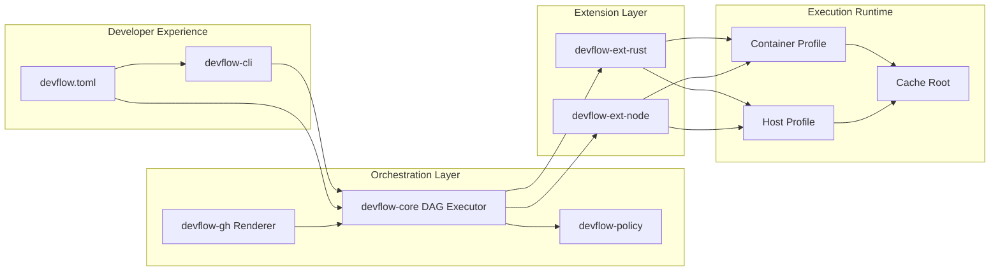

# v0.1.0 Architecture and Design Review Baseline

## 1. Objective

Define one implementation-ready baseline for `devflow` so we can:

1. Agree architecture boundaries.
2. Lock design details and non-goals.
3. Run a review gate before implementation starts.

This document consolidates the existing brainstorm and decision docs into one practical plan.

## 2. Scope and Non-Goals

In scope for v0.1.0:

- Standalone `devflow` CLI (`devflow`, alias `dwf`).
- Canonical command graph and deterministic execution model.
- Rust-first extension with Node baseline extension.
- Container and cache strategy for local and CI parity.
- GitHub Actions rendering and required-check contracts.

Out of scope for v0.1.0:

- Full multi-format serialization matrix for all paths.
- Broad plugin marketplace/runtime distribution.
- Advanced multi-provider CI backends beyond GitHub Actions.

## 3. Architecture Overview



Architecture constraints:

- `devflow-core` is stack-agnostic.
- Stack-specific logic lives in `devflow-ext-*`.
- CI YAML orchestrates only; command semantics stay in `devflow`.

## 4. Workspace Structure (Target)

```text
devflow/
  Cargo.toml
  crates/
    devflow-core/
    devflow-cli/
    devflow-policy/
    devflow-gh/
    devflow-ext-rust/
    devflow-ext-node/
  examples/
    rust-lib/
    node-ts/
  docs/
```

Ownership boundaries:

- `devflow-core`: task graph, execution engine, cache key coordination.
- `devflow-cli`: UX, argument parsing, command dispatch.
- `devflow-policy`: gate profiles, required check contracts.
- `devflow-gh`: workflow generation and validation.
- `devflow-ext-*`: command-to-toolchain translation.

## 5. Canonical Command Contract

### Command hierarchy for developer experience

Based on common workflows across Rust, Node, Python, JVM, and polyglot repos, commands work best when split into two levels:

- Primary commands: stable verbs developers run daily.
- Secondary commands: scoped variants selected by policy, profile, or explicit command target.

First-principles rules used:

- Keep top-level verbs small and stable.
- Make mutating vs non-mutating behavior explicit (for example `fmt:fix` vs `fmt:check`).
- Push environment-specific behavior to selectors, not new top-level commands.
- Model policy gates as composition (`check:*`), not as a separate legacy workflow command.

### Primary commands (v0.1.0 baseline)

| Primary command | Purpose | Typical effect |
| --- | --- | --- |
| `setup` | Prepare local/CI prerequisites. | Installs/syncs toolchains, dependencies, and optional container prerequisites. |
| `fmt` | Format source according to project rules. | Uses selectors such as `fmt:check` (read-only) and `fmt:fix` (mutating). |
| `lint` | Run static and policy checks. | Reports code quality and policy violations. |
| `build` | Compile/package artifacts. | Produces build outputs for current profile. |
| `test` | Run automated tests. | Executes selected test suites (`test:unit`, `test:integration`, etc.). |
| `package` | Assemble distributable outputs. | Produces artifacts/images/bundles and metadata. |
| `check` | Execute policy-defined non-mutating gate. | Composes selectors for contexts like `check:pr`, `check:main`, `check:release`. |
| `release` | Execute release orchestration steps. | Produces release candidates, publish steps, and release metadata. |
| `ci` | Manage CI contract generation and validation. | Handles selectors such as `ci:render`, `ci:check`, and `ci:plan`. |

### Secondary command families

- `setup`: `setup:toolchain`, `setup:deps`, `setup:container`, `setup:doctor`
- `fmt`: `fmt:check`, `fmt:fix`
- `lint`: `lint:static`, `lint:security`, `lint:policy`, `lint:fix`
- `build`: `build:debug`, `build:release`
- `test`: `test:unit`, `test:integration`, `test:contract`, `test:e2e`, `test:smoke`, `test:load`
- `package`: `package:artifact`, `package:image`, `package:sbom`
- `check`: `check:pr`, `check:main`, `check:release`
- `release`: `release:candidate`, `release:publish`, `release:notes`
- `ci`: `ci:render`, `ci:check`, `ci:plan`

Secondary commands may be exposed as:

- explicit subcommands (for example `dwf test unit` mapped to `test:unit`), or
- profile aliases in config (for example `targets.pr = ["fmt:check", "lint:static", "build:debug", "test:unit", "test:integration"]`).

### Command behavior rules

- Same command names across stacks.
- Primary commands are contract-stable; secondary commands are extension-capability dependent.
- Extension maps canonical commands and secondary variants to stack-native operations.
- `check` is policy-driven composition of primary and secondary commands.

Legacy alias compatibility (migration window):

- `verify` maps to `check`.
- `smoke` maps to `test:smoke`.

### Alternative considered

Alternative: many narrow top-level commands (`unit-test`, `integration-test`, `security-scan`, `package`, `release-check`).
Decision: reject for v0.1.0 because it increases cognitive load and weakens cross-stack portability.

## 6. Configuration Contract (`devflow.toml`)

Minimum schema for v0.1.0:

```toml
[project]
name = "example"
stack = ["rust"]

[container]
image = "ghcr.io/org/repo-ci"
fingerprint_inputs = ["Dockerfile", "Makefile", "src-scripts/**", "rust-toolchain.toml"]

[cache]
root = ".cache/devflow"
strategy = "layered"

[targets]
pr = ["fmt:check", "lint:static", "build:debug", "test:unit", "test:integration"]
main = ["fmt:check", "lint:static", "build:release", "test:unit", "test:integration", "test:smoke"]
```

Rules:

- Unknown keys are ignored with warnings (forward compatibility).
- Missing required fields fail fast with actionable diagnostics.
- Defaults exist for local bootstrap where safe.

## 7. Execution and Runtime Design

Execution model:

1. Load `devflow.toml`.
2. Resolve stack extensions.
3. Build command DAG.
4. Select runtime profile (`container`, `host`, or `auto`).
5. Resolve execution identity (container fingerprint or host toolchain fingerprint).
6. Resolve and restore cache layers.
7. Execute task graph with deterministic ordering.
8. Emit check status and artifacts.

Runtime profile policy:

- `container`: default for CI and recommended for reproducibility.
- `host`: allowed when projects explicitly opt out of container-first execution.
- `auto`: use container when available, otherwise host with compatibility checks.

Host compatibility checks (required in `host` and `auto` profiles):

- toolchain version compliance (`rust-toolchain.toml`, Node version, etc.)
- required binary availability
- OS/arch support guardrails
- extension-declared prerequisites

Determinism constraints:

- Execution identity must include all declared fingerprint inputs and runtime profile.
- Cache keys must include `os`, `arch`, toolchain lock dimensions.
- Correctness must not depend on cache hits.

## 8. Container and Cache Design

Canonical cache root:

- `DEVFLOW_CACHE_ROOT` (default `.cache/devflow`)
- Subdirectories:
  - `registry/`
  - `git/`
  - `sccache/`
  - `target-ci/`
  - `image-tar/`
  - `buildx/`

Policy:

- Project-scoped cache by default.
- Keep local and CI layout consistent.
- Treat cache as optimization only.
- Allow profile-specific cache partitioning (`container` vs `host`) to avoid artifact contamination.

## 9. CI Design Contract (GitHub Actions)

Job topology:

- `prep`: fingerprint resolution and image selection.
- `build`: compile baseline once in CI container.
- `fmt`, `lint`, `test-unit`, `test-integration`, `test-smoke` (optional): parallel check jobs with clear status visibility.

CI contract:

- CI uses `dwf`/Make entrypoints only.
- No business logic in workflow YAML.
- Required checks and branch policy generated from config.

## 10. Extension System Design

Extension API requirements:

- Map canonical commands to executable actions.
- Declare capabilities (`container-required`, `supports-test-smoke`, etc.).
- Return normalized result envelopes for policy and status emitters.

### Extension discovery model

v0.1.0 supports two discovery sources:

1. Built-in extensions linked with the binary.
2. Local project extensions declared by path in config.

Post-v0.1.0 registry support (planned):

- named extension source (`registry = "ghcr|git|custom"`)
- signed metadata and integrity checks
- registry index pinning for reproducibility

### Extension declaration (proposed)

```toml
[extensions.rust]
source = "builtin"
version = "^0.1"

[extensions.node]
source = "builtin"
version = "^0.1"

[extensions.custom_lint]
source = "path"
path = "./tools/devflow-ext-custom-lint"
version = "0.1.0"
```

### Versioning and compatibility checks

- Extension API has an explicit `api_version` (for example `1`).
- Core checks compatibility before loading:
  - API compatibility: extension `api_version == core.api_version`
  - semantic version policy: extension version satisfies configured range
  - capability contract: required capabilities exist for selected command/profile
- Incompatible extension behavior:
  - hard fail for required extensions
  - warning + skip for optional extensions

### Extension loading lifecycle

1. Discover configured extensions.
2. Resolve versions against lock/constraints.
3. Validate checksums/signatures (when source supports it).
4. Run compatibility checks.
5. Build command capability map.
6. Load execution adapter and run health probe.
7. Register into command dispatcher.

### Compatibility lock file (proposed)

`devflow.lock` captures:

- resolved extension versions
- source and integrity digest
- resolved capability map
- runtime profile constraints

v0.1.0 extension sequence:

1. `devflow-ext-rust` (first class).
2. `devflow-ext-node` (baseline parity).

Deferred:

- remote registry distribution and install workflows.

## 11. Phase-Gated Delivery Plan

Phase A0: governance and ADRs.
Phase A1: core engine + command graph + container/cache contract.
Phase A2: extension API with Rust and Node support.
Phase A3: distribution and docs.

Mandatory phase gates:

- Quality gate: `fmt:check`, `lint:static`, `build:debug/release`, `test:unit`, `test:integration` (and `test:smoke` where required).
- Architecture gate: command contract stability, extension API checks, CI/local parity audit.

## 12. Design Review Findings

Key strengths:

- Clear separation between core orchestration and stack extensions.
- Stable command surface for developers.
- Deterministic CI/local model with explicit cache contracts.

Key risks:

- Over-abstraction too early in extension APIs.
- Fingerprint input drift between code and docs.
- Policy/YAML divergence if rendering contract is weakly enforced.

Required mitigations:

- Keep v0.1.0 API minimal and measured.
- Add fingerprint conformance test.
- Add CI rendering snapshot tests and policy validation checks.

## 13. Review Checklist (Pre-Implementation Gate)

Architecture:

- [ ] Core crate has no stack-specific logic.
- [ ] Extension API is minimal and documented.
- [ ] Command contract is finalized and versioned.

Runtime:

- [ ] Fingerprint inputs are single-sourced and test-covered.
- [ ] Cache key dimensions are explicit and documented.
- [ ] Container fallback behavior is defined.

CI/Policy:

- [ ] Workflow render output is deterministic.
- [ ] Required checks align with target profiles.
- [ ] YAML contains orchestration only.

Developer UX:

- [ ] Error messages include clear next actions.
- [ ] Local command names exactly match CI targets.
- [ ] `dwf check` behavior is documented and reproducible.
- [ ] Primary and secondary command semantics are documented.

Extensions:

- [ ] Extension discovery sources are explicitly configured.
- [ ] Compatibility checks are enforced before execution.
- [ ] Required extension failures are deterministic and actionable.

## 14. Decisions to Confirm Before Implementation

1. Cache env var name: adopt `DEVFLOW_CACHE_ROOT` (recommended) or keep legacy naming.
2. PR gate defaults: keep `test:smoke` required in PR or move to `main` only.
3. Runtime profile default: `container` for all projects, or `auto` with host fallback by default.
4. Node extension scope in v0.1.0: baseline (`fmt/lint/test/build`) or full parity including `test:smoke`.
5. Extension discovery scope in v0.1.0: built-in only, or built-in + local-path extensions.
6. Workflow ownership: generated files committed to repo or generated on-demand in CI.

## 15. Implementation Start Condition

Implementation begins only when section 14 decisions are confirmed and section 13 checklist is approved.
